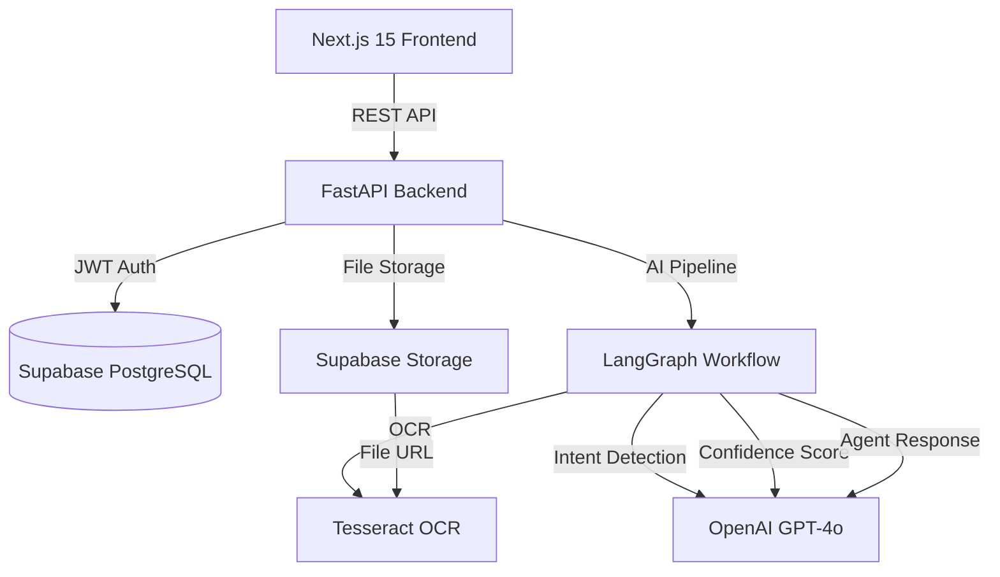

# FlowPilot AI

> AI-powered inbox orchestration and workflow automation for modern teams

[](https://github.com/your-org/flowpilot-ai/actions)
[](LICENSE)

FlowPilot AI automatically classifies incoming business messages and documents,
routes them to specialized AI agents (Sales, Support, Finance, Executive),
and returns structured, actionable results — all within seconds.

---

## Features

- **AI Inbox** — Submit text or documents; AI classifies and routes automatically
- **4 Specialized Agents** — Sales, Customer Support, Finance, and Executive agents
- **Document Intelligence** — Upload invoices/documents for AI-powered data extraction
- **OCR Pipeline** — Tesseract OCR processes PDF and image attachments
- **LangGraph Workflow** — Visual, auditable AI processing pipeline
- **Analytics Dashboard** — Real-time submission stats, daily trends
- **Workflow History** — Full audit trail of every AI-processed submission
- **Dark Mode** — Full light/dark/system theme support
- **Admin Controls** — Demo data reset and seeding for presentations

---

## Architecture



### Stack

| Layer | Technology |
|-------|-----------|
| Frontend | Next.js 15, TypeScript, Tailwind CSS, Shadcn UI, Framer Motion |
| Charts | Recharts |
| State | Zustand (persist) |
| HTTP | Axios |
| Backend | FastAPI, Python 3.11, Pydantic v2 |
| Database | PostgreSQL (Supabase) via SQLAlchemy 2.0 (async) |
| Migrations | Alembic |
| Auth | Custom JWT (python-jose + bcrypt) |
| AI | LangGraph, LangChain, OpenAI GPT-4o |
| OCR | Tesseract OCR + pdf2image |
| File Storage | Supabase Storage |
| Logging | structlog |
| Container | Docker + Docker Compose |

---

## Quick Start

### Prerequisites

- Node.js 20+
- Python 3.11+
- Tesseract OCR: `sudo apt-get install tesseract-ocr` (Linux) / `brew install tesseract` (Mac)
- Poppler: `sudo apt-get install poppler-utils` (Linux) / `brew install poppler` (Mac)
- A [Supabase](https://supabase.com) project (free tier works)
- An [OpenAI](https://platform.openai.com) API key

### 1. Clone the repository

```bash
git clone https://github.com/your-org/flowpilot-ai.git
cd FlowPilot-AI
```

### 2. Configure the backend

```bash
cd backend
cp .env.example .env
```

Edit `.env` and fill in:
- `SECRET_KEY` — generate with: `python -c "import secrets; print(secrets.token_hex(32))"`
- `DATABASE_URL` — your Supabase PostgreSQL connection string
- `SUPABASE_URL`, `SUPABASE_KEY`, `SUPABASE_SERVICE_KEY` — from Supabase dashboard
- `OPENAI_API_KEY` — from OpenAI platform

### 3. Configure the frontend

```bash
cd frontend
cp .env.local.example .env.local
```

Edit `.env.local`:
- `NEXT_PUBLIC_API_URL=http://localhost:8000`
- `NEXT_PUBLIC_SUPABASE_URL` — same as backend
- `NEXT_PUBLIC_SUPABASE_ANON_KEY` — Supabase anon/public key

### 4. Install dependencies

```bash
# Backend
cd backend
python -m venv .venv
source .venv/bin/activate      # Windows: .venv\Scripts\activate
pip install -r requirements.txt

# Frontend
cd frontend
npm install
```

### 5. Run database migrations

```bash
cd backend
alembic upgrade head
```

### 6. Create a Supabase Storage bucket

In your Supabase dashboard:
1. Go to **Storage** → **New bucket**
2. Name: `flowpilot-uploads`
3. Enable **Public bucket**
4. Set file size limit: **10MB**
5. Allowed MIME types: `application/pdf, image/png, image/jpeg`

### 7. Start the development servers

```bash
# Terminal 1 — Backend
cd backend
uvicorn main:app --reload --port 8000

# Terminal 2 — Frontend
cd frontend
npm run dev
```

Open [http://localhost:3000](http://localhost:3000) — you'll be redirected to the login page.

---

## Docker Quickstart

```bash
# Copy environment files
cp backend/.env.example backend/.env
cp frontend/.env.local.example frontend/.env.local
# Fill in your actual values in both .env files

# Start everything
docker compose up --build

# Frontend: http://localhost:3000
# Backend:  http://localhost:8000
# API docs: http://localhost:8000/docs
```

---

## Environment Variables

### Backend (`backend/.env`)

| Variable | Required | Description |
|----------|----------|-------------|
| `SECRET_KEY` | ✅ | JWT signing secret (min 32 chars) |
| `DATABASE_URL` | ✅ | PostgreSQL connection URL |
| `SUPABASE_URL` | ✅ | Supabase project URL |
| `SUPABASE_KEY` | ✅ | Supabase anon key |
| `SUPABASE_SERVICE_KEY` | ✅ | Supabase service role key |
| `OPENAI_API_KEY` | ✅ | OpenAI API key (starts with `sk-`) |
| `DEBUG` | — | `true` for development (default: `false`) |
| `ALGORITHM` | — | JWT algorithm (default: `HS256`) |
| `ACCESS_TOKEN_EXPIRE_MINUTES` | — | Token lifetime (default: `60`) |
| `ALLOWED_ORIGINS` | — | CORS origins JSON array |

### Frontend (`frontend/.env.local`)

| Variable | Required | Description |
|----------|----------|-------------|
| `NEXT_PUBLIC_API_URL` | ✅ | Backend base URL |
| `NEXT_PUBLIC_SUPABASE_URL` | ✅ | Supabase project URL |
| `NEXT_PUBLIC_SUPABASE_ANON_KEY` | ✅ | Supabase public anon key |

---

## API Reference

The FastAPI backend provides interactive docs at `http://localhost:8000/docs` (development only).

### Auth
| Method | Path | Auth | Description |
|--------|------|------|-------------|
| `POST` | `/api/v1/auth/register` | None | Register new user |
| `POST` | `/api/v1/auth/login` | None | Login, get JWT |
| `GET` | `/api/v1/auth/me` | Bearer | Get current user |

### Inbox
| Method | Path | Auth | Description |
|--------|------|------|-------------|
| `POST` | `/api/v1/inbox/submit` | Bearer | Submit for AI processing |
| `GET` | `/api/v1/inbox/{id}` | Bearer | Get submission status |
| `GET` | `/api/v1/inbox/` | Bearer | List submissions (paginated) |

### Documents
| Method | Path | Auth | Description |
|--------|------|------|-------------|
| `POST` | `/api/v1/documents/extract-invoice` | Bearer | Extract invoice data from file |

### Analytics
| Method | Path | Auth | Description |
|--------|------|------|-------------|
| `GET` | `/api/v1/analytics/summary` | Bearer | Overall stats |
| `GET` | `/api/v1/analytics/by-agent` | Bearer | Per-agent breakdown |
| `GET` | `/api/v1/analytics/by-day?days=30` | Bearer | Daily activity |

### Admin (admin role only)
| Method | Path | Auth | Description |
|--------|------|------|-------------|
| `POST` | `/api/v1/admin/reset-demo` | Bearer (admin) | Delete all submissions |
| `POST` | `/api/v1/admin/seed-demo` | Bearer (admin) | Insert demo data |
| `GET` | `/api/v1/admin/users` | Bearer (admin) | List all users |

---

## Running Tests

```bash
cd backend
pytest tests/ -v
```

To run with coverage:
```bash
pytest tests/ -v --cov=app --cov-report=term-missing
```

---

## Deployment

See [`docs/045_Deployment.md`](docs/045_Deployment.md) for complete deployment instructions.

**TL;DR:**
- Frontend → Vercel (automatic via GitHub Actions on push to `main`)
- Backend → Railway (automatic via GitHub Actions on push to `main`)
- Database → Supabase (managed PostgreSQL)

---

## Project Structure

```
FlowPilot-AI/
├── frontend/               # Next.js 15 application
│   ├── app/                # App Router pages
│   ├── components/         # React components
│   ├── hooks/              # Custom hooks
│   ├── store/              # Zustand stores
│   ├── lib/                # Utilities
│   └── types/              # TypeScript types
├── backend/
│   ├── app/
│   │   ├── api/            # FastAPI route handlers
│   │   ├── agents/         # LangGraph agents
│   │   ├── core/           # Config, auth, exceptions
│   │   ├── db/             # SQLAlchemy models
│   │   ├── schemas/        # Pydantic schemas
│   │   └── services/       # Business logic services
│   ├── alembic/            # Database migrations
│   └── tests/              # Pytest test suite
├── docs/                   # Engineering documentation (46 task files)
├── docker-compose.yml
└── README.md
```

---

## Contributing

1. Fork the repository
2. Create a feature branch: `git checkout -b feature/your-feature`
3. Follow the existing code style (Black/isort for Python, ESLint/Prettier for TypeScript)
4. Write tests for new functionality
5. Run the test suite: `pytest tests/ -v`
6. Run type checking: `npm run type-check` (frontend)
7. Submit a pull request

---

## License

MIT License — see [LICENSE](LICENSE) for details.
